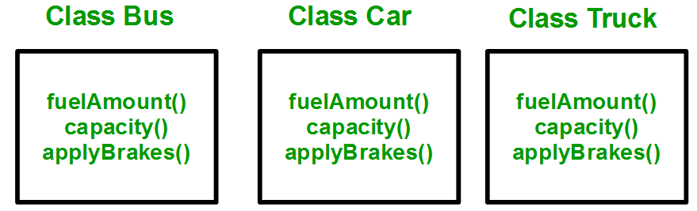

# 5 - Inheritance and Polymorphism

Inheritance is one of the essential characteristcs of Object Oriented Programming. It is the capability of a class to derive properties and characteristics from another class.

* **Sub Class**: The class that inherits properties from another class is called *Sub class* or *Derived Class*.
* **Super Class**:The class whose properties are inherited by sub class is called *Base Class* or *Super class*.

### Why and when use it?

Consider a group of vehicles. You need to create classes for **Bus**, **Car** and **Truck**. The methods `fuelAmount()`, `capacity()`, `applyBrakes()` will be same for all of the three classes. 

If we create these classes avoiding inheritance then we have to write all of these functions in each of the three classes as shown in below figure:



You can clearly see that above process results in duplication of same code 3 times. This increases the chances of error and data redundancy. To avoid this type of situation, inheritance is used. 

If we create a class `Vehicle` and write these three methods (functions) in it and inherit the rest of the classes from the vehicle class, then we can simply avoid the duplication of data and increase re-usability. 

Look at the below diagram in which the three classes are inherited from vehicle class:


Using inheritance, we have to write the functions only one time instead of three times as we have inherited rest of the three classes from base class(Vehicle).

### Implementing inheritance in C++

#### Synthax

```c++
class subclass_name : access_mode base_class_name
{
  //body of subclass
};
```

Here, `subclass_name` is the name of the sub class, `access_mode` is the mode in which you want to inherit this sub class for example: `public`, `private` etc. And `base_class_name` is the name of the base class from which you want to inherit the sub class.

**Note:** A derived class **doesn’t** inherit access to `private` data members. However, it does inherit a full parent object, which contains any private members which that class declares.

### Vehicle class example

Using the example of the `Vehicle` class as in the image above, but instead of implementing the methods `fuelAmount()`, and `capacity()` we are going to make them turn into **Getter Methods** and include atributtes in the `Vehicle` class.

We could implemented it like this:

**1. Vehicle.h**
```c++
#ifndef VEHICLE_H
#define VEHICLE_H

class Vehicle{
    public:
        Vehicle();
        ~Vehicle();
        int getFuelAmount();
        int getCapacity();

        void applyGas(); // method that increases acceleration value in 1 unit
        void applyBreaks(); // method that decreases the acceleration value in 1 unit

        void setPassengers(int x);

    protected:
        int fuel;
        int nPassengers;
        int acceleration;
};

#endif // VEHICLE_H
}
```

**2. Vehicle.cpp**
```c++
#include "Vehicle.h"

Vehicle::Vehicle(){
    cout << "This is a vehicle." << endl;
    
    fuel = 100; // vehicle always starts with a full tank
    acceleration = 0;
    nPassengers = 1; // vehicle start with at least one seat (driver) 
}

int Vehicle::getFuelAmount(){
    return fuel;
}

int Vehicle::getCapacity(){
    return numberOfSeats;
}

void Vehicle::applyGas(){
    acceleration++;
    fuel -= acceleration;
}

void Vehicle::appleBreaks(){
    acceleration--;
}

void Vehicle::setPassengers(int x){
    nPassengers = x;
}
```