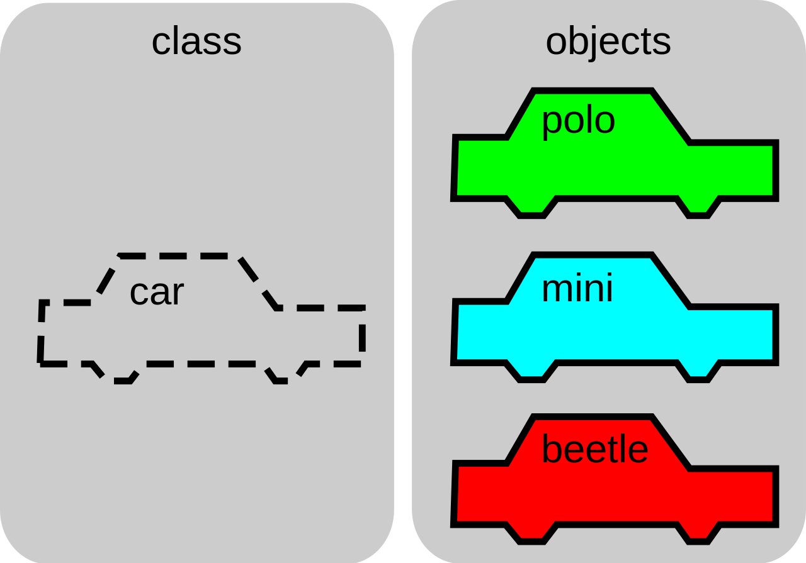

# Object Oriented Programming

## Mission

This guide was developed to help members from Skyrats - Autonomous Drones Team from Escola Politécnica da Universidade de São Paulo - to understand the concepts of object oriented programming in C++.

It assumes that the preson who is reading this is already used to programming in C++. If ythis is not your case, please check out the other tutorial about <a href="https://github.com/SkyRats/cpp_workshop">C++ Basic Concepts</a> before following this one.

Since it is a routine for the members to be asked to install Linux (Ubuntu 16.04 LTS) when they enter the team, some instructions are given to be inserted on a Linux Terminal.

If that may be an issue, you can easily follow this guide using an IDE (Codeblocks is a good starting IDE).

## Prerequisites

* **Compilers**:

  * GCC (Linux)

  * MinGW (Windows)

## Contents

* Definition and Paradigms
* Concepts
* Encapsulation
* Constructors and Destructors
* Inheritance and Polymorphism
* Abstract Classes and Multiple Inheritance
* Defensive Programming
* Data Persistence
* Namespace, Templates and Standard Libraries

## Definition and Paradigms

Developing software does not envolve only a programming language itself, a good aspect to consider when developing anything is the programming paradigm, or the "way" of programming. 

To be more precise Timothy Budd describes it as "... way of conceptualizing what ist means to preform copmutation, of structuring and organizing how tasks are to be carried out on a computer." in his seminal <a href="https://books.google.com.br/books/about/Multiparadigm_Programming_in_Leda.html?id=qqxQAAAAMAAJ&redir_esc=y">book</a> on multiparadigm programming.

Each language has one or more paradigms. Some examples of paradigms and respective languages:

* Imperative: Pascal and Cobol
* Functional: Lisp, Haskel and Scala
* Logic: Prolog and Datalog
* **Object-Oriented: C++, C#, Java and Python**
* Event-Driven: used mostly in graphcal interfaces
* Declarative: SQL and HTML

In this way, Object Oriented Programming differs from others paradigms because it includes both data and functions. In addition, we are able to create relationships between one object and another.

## Concepts

### ADT - Abstract Data Type

An Abstract Data Type (ADT) is formally defined as a type (or class) for objects whose behavior is defined by a set of value and a set of operations. 

To be more clear, it basically let you define new type of data (not only having to work with int, char, double, etc). ADT's encapsulate data and different operations for any type of data and it also does not depend of how the data is stored or implemented. They are they "way" to abstract the real world because you could create any type of data.

### Class

A class is a data structure that implements an ADT. It represents the common characteristics in a group of objects (abstraction).

For example, we can think in a class called "car" and create objects that may have different characteristics, like different colors or different names, but they all have something in common, they all have 4 wheels, a motor, a gear mechanism, etc.

The image above shows how a <code>Car</code> object can be the template for many other <code>Car</code> instances. A class not only can define a <code>Car</code> object's atributtes (color, number of passengers it can take, etc), but it also can define how it is going to work, or what are going to be its methods (operations). For example, we could create a method <code>accelerate</code> that changes the object's current speed.

### Object

An object is simply an instance of a class, an element of the computer system. It has its singular characteristcs as *Behavior*, *State* and *Identity*.

Example: Lamp

* Behavior - Turn On, Turn Off, getState.
* State - On, Off.
* Identity - Living Room Lamp.

### Attribute

An attribute is basically a class' property. It represents the data.

### Operation

An operation is just specifies which functionality an object supports, but it has no implementation. It is similar to a function prototype as we usually see in C language.

### Method

A method is a implementation of an operation. 

**Note:** We usually don't use the term operation, we refer as methods.

## Encapsulation

## Constructors and Destructors

## Inheritance and Polymorphism

## Abstract Classes and Multiple Inheritance

## Defensive Programming

## Data Persistence

## Namespace, Templates and Standard Libraries

## Reference

The reference to this guide is mostly based on a discipline (PCS3111 - Laboratório de Programação Orientada à Objetos para Engenharia Elétrica) given by the **Computer Engineering and Digital Systems Department (PCS)** from **Escola Politécnica da Universidade de São Paulo** to Electrical Enginerring Students on their second semester. 

The complete material is available, in Portuguese, in this repository.

#### Useful Links

<a href="https://docs.google.com/document/d/136qoVExYsV5zqmuF49-Rm3RgqCdc9mjc4prDhwLXV2U/edit">Plot</a> written to help the workshop given in 12/22/2019.